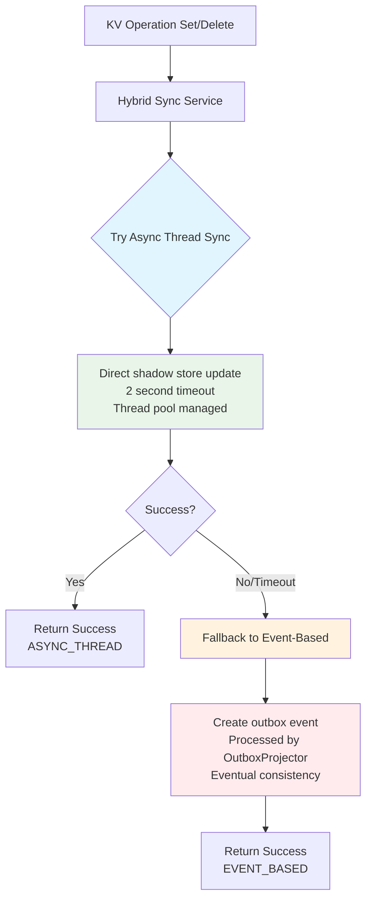

# Hybrid Synchronization Guide

## Overview

The Hybrid Synchronization Service implements a dual-strategy approach for cache synchronization that addresses peak hour performance issues by combining async thread synchronization with event-based fallback.

## Problem Statement

During peak hours, event queues can become delayed, causing cache synchronization lag. The hybrid approach solves this by:

1. **First Attempt**: Direct async thread synchronization for immediate consistency
2. **Fallback**: Event-based synchronization when async threads fail or timeout

## Architecture

### Components

1. **HybridSyncService**: Core service managing the dual-strategy approach
2. **HybridSyncTools**: MCP tools for monitoring and manual control
3. **Updated KvTools**: Now uses hybrid sync for all KV operations
4. **Configuration**: Tunable parameters for thread management and timeouts

### Flow Diagram



## Key Features

### 1. Adaptive Strategy Selection

The service includes an `adaptiveSync` method that automatically chooses the strategy based on system load:

- **Normal Load**: Uses hybrid approach (async first, event fallback)
- **High Load**: Skips async and goes directly to event-based sync

### 2. Load Detection

System is considered under high load when:
- Thread pool is 80%+ saturated
- Thread queue has pending tasks
- More than 100 unprocessed outbox events

### 3. Comprehensive Monitoring

- Thread pool statistics
- Sync success/failure rates
- Method used for each operation
- System load indicators

## Configuration

```yaml
app:
  sync:
    async-timeout-ms: 2000      # Timeout for async sync attempts
    max-async-threads: 10       # Maximum async thread pool size
```

## MCP Tools

### Available Tools

1. **hybrid_sync_stats**: Get detailed sync statistics
2. **hybrid_sync_load_check**: Check current system load
3. **hybrid_sync_manual**: Manually trigger hybrid sync
4. **hybrid_sync_delete**: Manually trigger hybrid delete sync
5. **hybrid_sync_adaptive**: Use adaptive strategy

### Example Usage

```bash
# Check system load and sync stats
curl -X POST http://localhost:8080/mcp/message \
  -H "Content-Type: application/json" \
  -d '{
    "method": "tools/call",
    "params": {
      "name": "hybrid_sync_stats"
    }
  }'

# Check if system is under high load
curl -X POST http://localhost:8080/mcp/message \
  -H "Content-Type: application/json" \
  -d '{
    "method": "tools/call",
    "params": {
      "name": "hybrid_sync_load_check"
    }
  }'
```

## Benefits

### 1. Improved Peak Hour Performance
- Immediate sync during normal operations
- Graceful degradation under load
- No sync failures during high traffic

### 2. Reliability
- Dual fallback mechanism
- Comprehensive error handling
- Automatic retry via event system

### 3. Observability
- Detailed metrics and monitoring
- Load-based decision making
- Performance tracking

## Implementation Details

### Async Thread Synchronization

```java
// Direct shadow store update
KVShadow shadow = KVShadow.builder()
    .key(key)
    .lastValue(value)
    .valueHash(valueHash)
    .lastWriteAt(Instant.now())
    .sessionId(sessionId)
    .interactionId(interactionId)
    .metadata(Map.of(
        "syncMethod", "ASYNC_THREAD",
        "syncTimestamp", Instant.now().toString()
    ))
    .build();
kvShadowRepo.save(shadow);
```

### Event-Based Fallback

```java
// Create outbox event for later processing
OutboxEvent event = OutboxEvent.builder()
    .type("KVMutated")
    .ts(Instant.now())
    .payload(payload)
    .processed(false)
    .build();
outboxRepo.save(event);
```

## Monitoring and Alerting

### Key Metrics to Monitor

1. **Sync Success Rate**: Percentage of operations using async vs event-based
2. **Thread Pool Utilization**: Active threads vs maximum
3. **Event Queue Depth**: Number of unprocessed outbox events
4. **Sync Latency**: Time taken for sync operations

### Recommended Alerts

- Thread pool saturation > 90%
- Unprocessed events > 500
- Sync failure rate > 5%
- Average sync latency > 5 seconds

## Troubleshooting

### Common Issues

1. **High Async Failure Rate**
   - Check database connectivity
   - Monitor thread pool saturation
   - Review timeout settings

2. **Event Queue Buildup**
   - Verify OutboxProjector is running
   - Check database performance
   - Consider scaling projector frequency

3. **Memory Issues**
   - Monitor thread pool size
   - Check for thread leaks
   - Review timeout configurations

### Debug Commands

```bash
# Get current sync statistics
hybrid_sync_stats

# Check system load
hybrid_sync_load_check

# Manual sync test
hybrid_sync_manual key=test value=data ttlSec=300
```

## Performance Tuning

### Thread Pool Sizing

- **CPU-bound operations**: Number of cores
- **I/O-bound operations**: 2-4x number of cores
- **Default**: 10 threads (suitable for most workloads)

### Timeout Configuration

- **Low latency networks**: 1000ms
- **Standard networks**: 2000ms (default)
- **High latency networks**: 5000ms

### Load Thresholds

Adjust load detection thresholds based on your environment:

```java
// Current thresholds
boolean threadPoolSaturated = activeThreads >= (maxThreads * 0.8);
boolean eventBacklog = unprocessedEvents > 100;
```

## Migration Guide

### From Event-Only to Hybrid

1. Deploy HybridSyncService
2. Update KvTools to use hybrid sync
3. Monitor sync statistics
4. Tune configuration based on load patterns

### Rollback Plan

If issues arise, you can disable hybrid sync by:

1. Reverting KvTools to use direct event creation
2. Stopping HybridSyncService
3. Relying on existing OutboxProjector

## Future Enhancements

1. **Circuit Breaker Pattern**: Automatically disable async sync during persistent failures
2. **Metrics Integration**: Prometheus/Grafana dashboards
3. **Dynamic Configuration**: Runtime adjustment of thresholds
4. **Batch Processing**: Group multiple sync operations for efficiency
