# Multi-Tier Persistence Strategy Guide

## Overview

The Multi-Tier Persistence Strategy extends the hybrid synchronization approach to handle different data persistence requirements for Redis (critical/fast access data) vs MongoDB (comprehensive data storage). This approach optimizes performance by caching only essential data in Redis while storing complete information in MongoDB.

## Problem Statement

Different types of data have different access patterns and requirements:

1. **Critical Data**: Needs immediate access (user sessions, current state)
2. **Comprehensive Data**: Complete records with full context and metadata
3. **Evaluation Data**: Analytics and assessment information (MongoDB only)
4. **Historical Data**: Archival information that doesn't need caching

## Architecture

### Data Flow Strategy

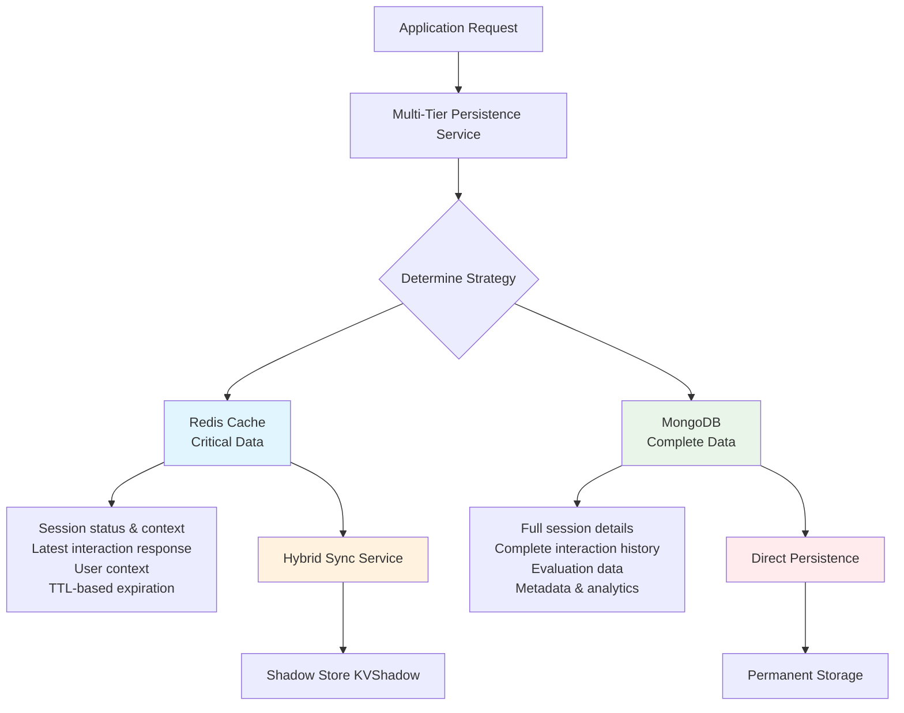

### Multi-Tier Architecture

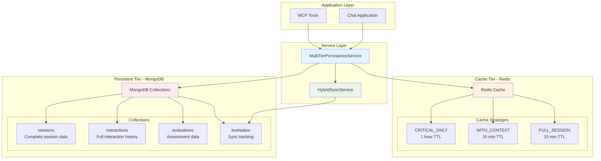

## Cache Strategies

### Session Cache Strategies

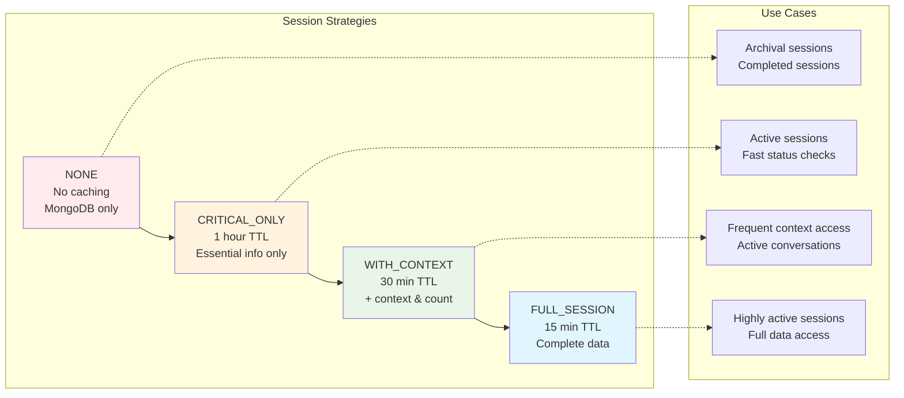

### Interaction Cache Strategies

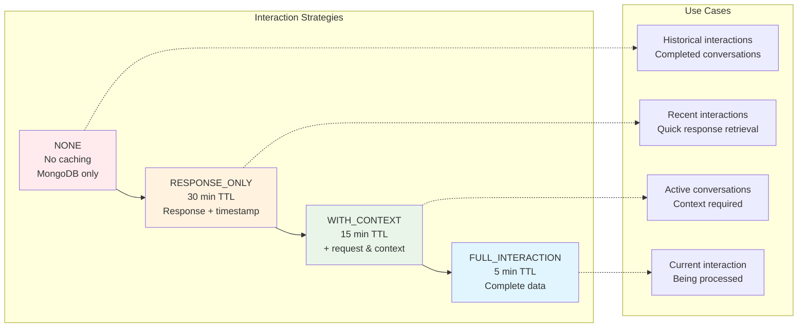

## Implementation Flow

### Session Persistence Flow

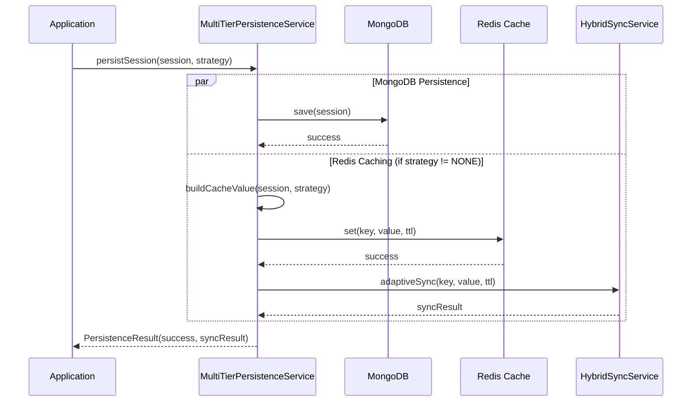

### Evaluation Data Flow

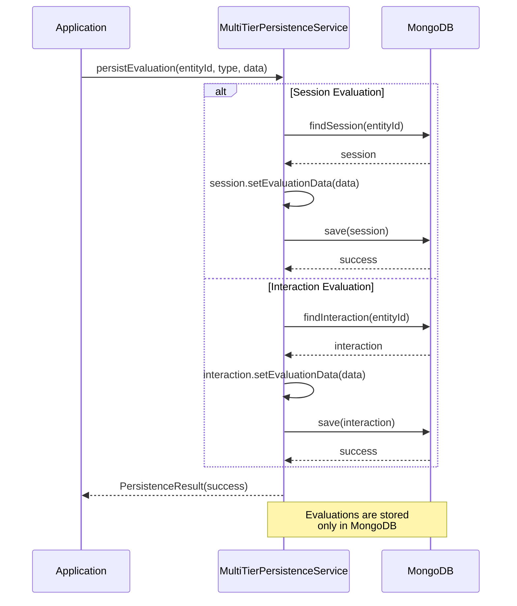

## MCP Tools

### Available Tools

#### Session Management
- `persist_session`: Create new session with caching strategy
- `update_session`: Update existing session with new data
- `get_session_cache_strategies`: List available caching strategies

#### Interaction Management
- `persist_interaction`: Store interaction with caching strategy
- `get_interaction_cache_strategies`: List available caching strategies

#### Evaluation Management
- `persist_evaluation`: Store evaluation data (MongoDB only)

#### Strategy Optimization
- `get_persistence_recommendations`: Get recommendations based on usage patterns
- `analyze_persistence_patterns`: Analyze current patterns and suggest optimizations

### Usage Examples

#### Persist High-Frequency Session
```bash
curl -X POST http://localhost:8080/mcp/message \
  -H "Content-Type: application/json" \
  -d '{
    "method": "tools/call",
    "params": {
      "name": "persist_session",
      "arguments": {
        "sessionId": "session-123",
        "userId": "user-456",
        "status": "active",
        "context": {"currentTopic": "product_inquiry"},
        "metadata": {"source": "web_chat"},
        "cacheStrategy": "WITH_CONTEXT"
      }
    }
  }'
```

#### Persist Interaction with Response Caching
```bash
curl -X POST http://localhost:8080/mcp/message \
  -H "Content-Type: application/json" \
  -d '{
    "method": "tools/call",
    "params": {
      "name": "persist_interaction",
      "arguments": {
        "interactionId": "int-789",
        "sessionId": "session-123",
        "role": "assistant",
        "request": "What are your product features?",
        "response": "Our product offers...",
        "context": {"intent": "product_info"},
        "processingTimeMs": 150,
        "cacheStrategy": "RESPONSE_ONLY"
      }
    }
  }'
```

#### Store Evaluation Data
```bash
curl -X POST http://localhost:8080/mcp/message \
  -H "Content-Type: application/json" \
  -d '{
    "method": "tools/call",
    "params": {
      "name": "persist_evaluation",
      "arguments": {
        "entityId": "session-123",
        "entityType": "session",
        "evaluationData": {
          "satisfaction_score": 4.5,
          "resolution_time": 300,
          "topics_covered": ["product_info", "pricing"],
          "sentiment": "positive"
        }
      }
    }
  }'
```

## Usage Patterns and Recommendations

### Pattern-Based Strategy Selection

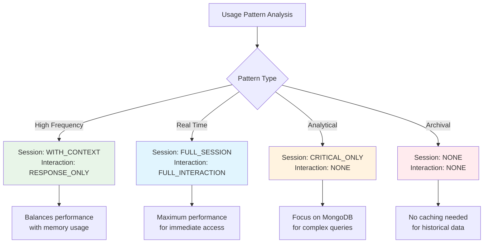

## Performance Characteristics

### Memory Usage Comparison

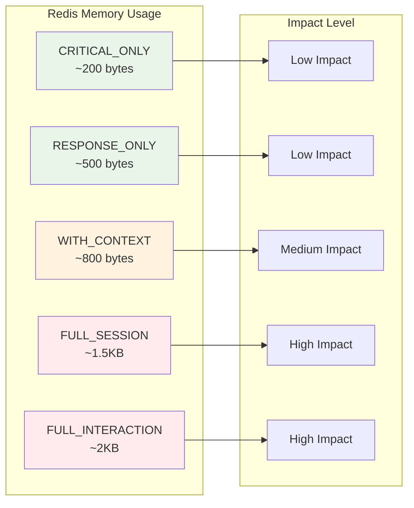

### Access Pattern Performance

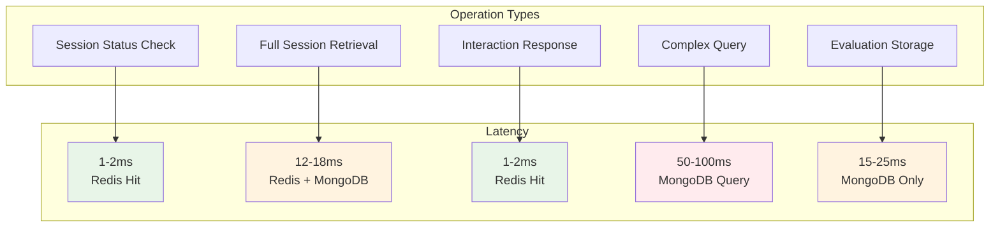

## Configuration

### Application Properties
```yaml
app:
  persistence:
    default-session-strategy: CRITICAL_ONLY
    default-interaction-strategy: RESPONSE_ONLY
    evaluation-storage: mongodb-only
    cache-compression: true
  sync:
    async-timeout-ms: 2000
    max-async-threads: 10
```

### Environment-Specific Strategies

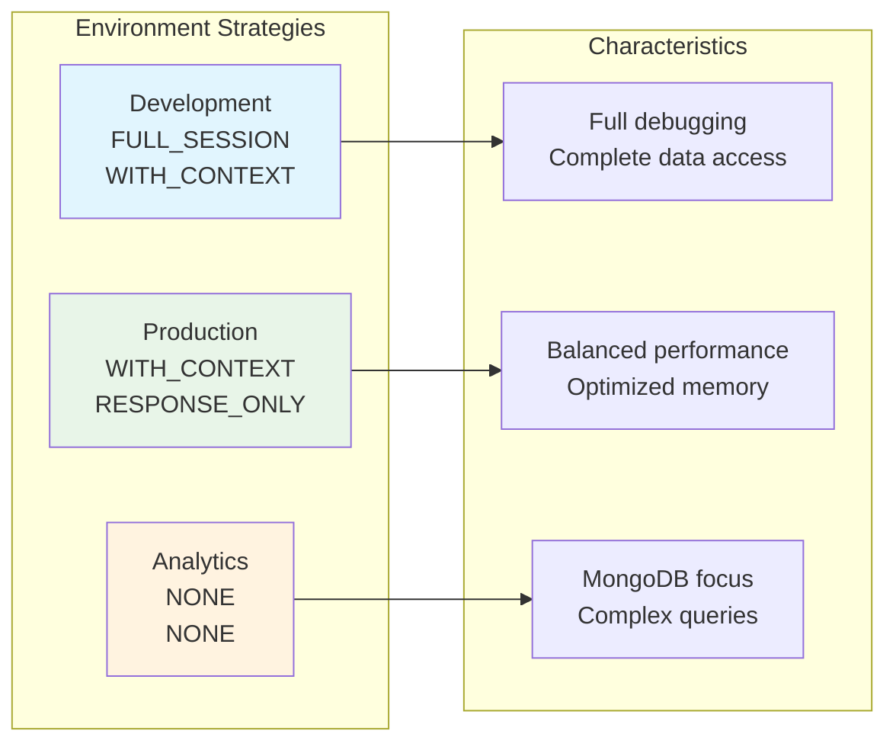

## Migration Guide

### Migration Flow

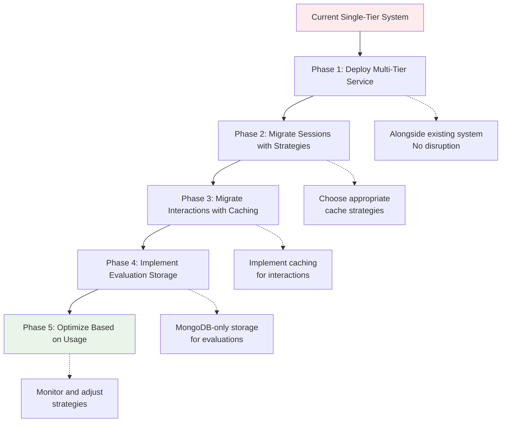

## Best Practices

### Strategy Selection Decision Tree

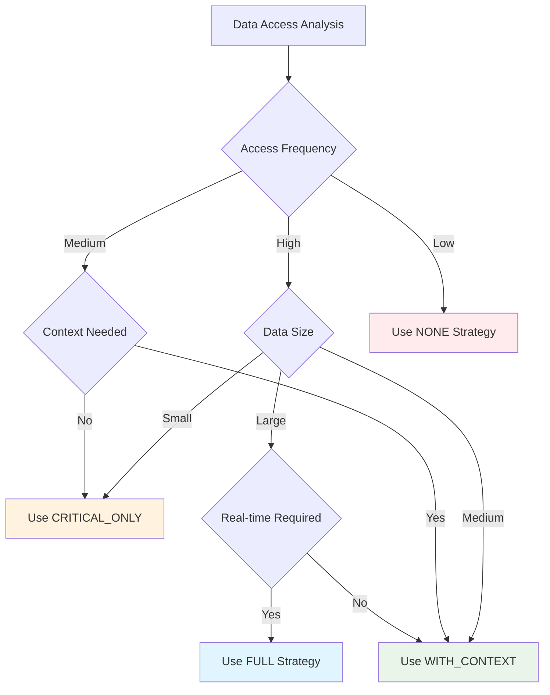

## Troubleshooting

### Common Issues and Solutions

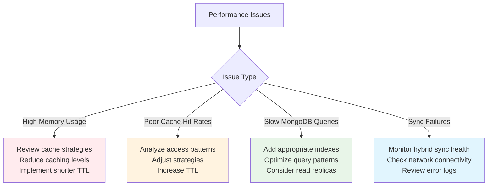

## Future Enhancements

### Roadmap

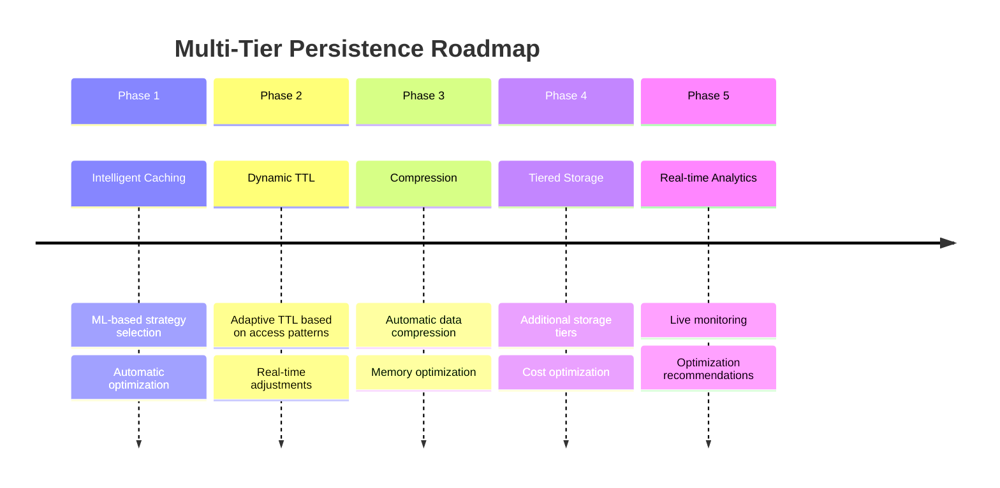

This multi-tier persistence strategy provides a comprehensive solution for handling different data access patterns while optimizing performance and resource usage. The hybrid synchronization ensures reliability during peak loads, while the configurable caching strategies allow for fine-tuned performance optimization based on specific use cases.
