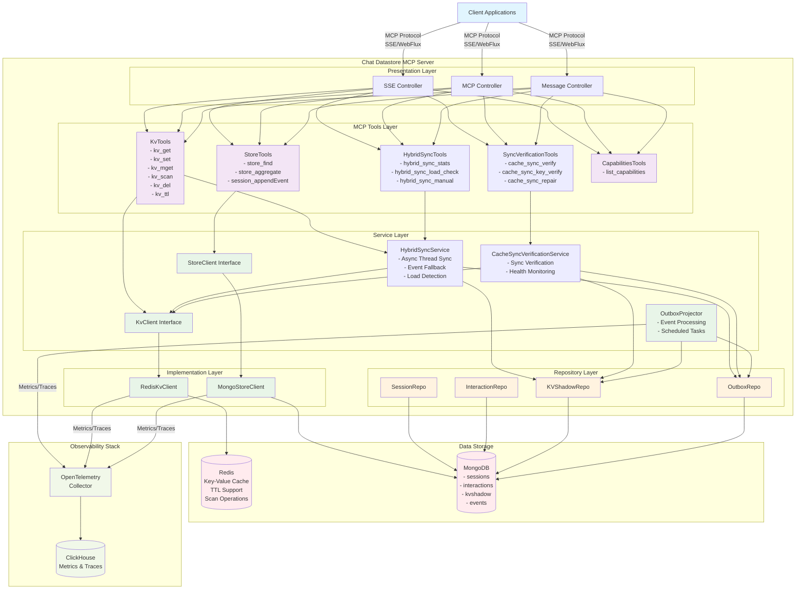
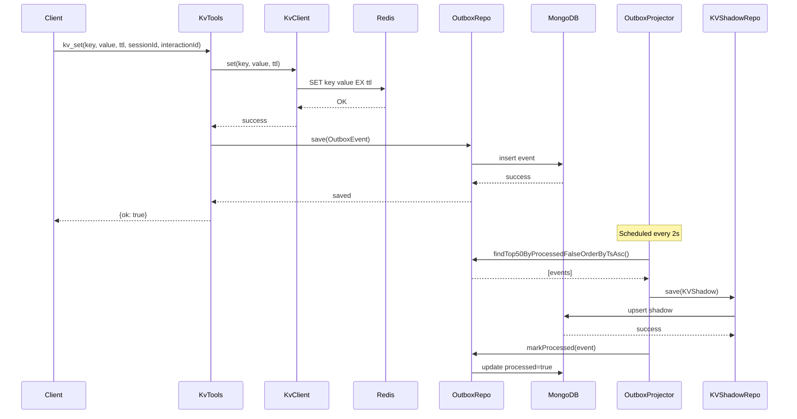
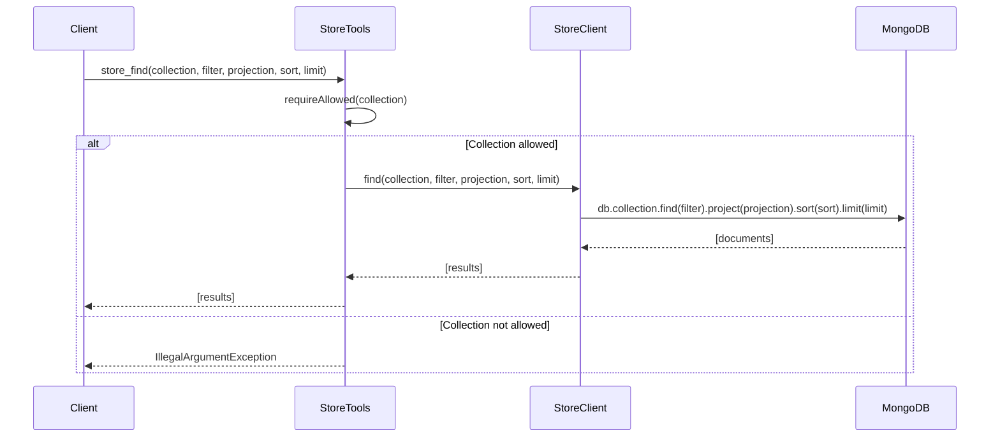
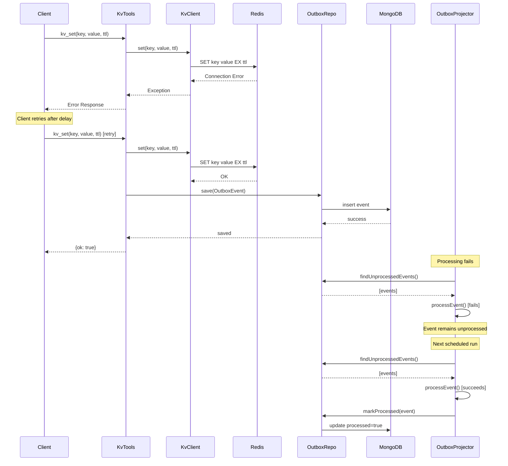
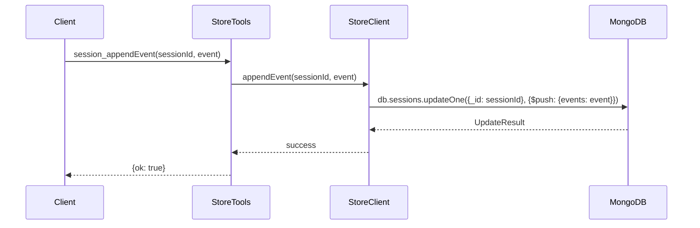

# Chat Datastore MCP Server

[](https://openjdk.java.net/)
[](https://spring.io/projects/spring-boot)
[](https://spring.io/projects/spring-ai)
[](https://docs.docker.com/compose/)
[](LICENSE)

## Application Overview

The Chat Datastore MCP Server is a Spring Boot application that implements the Model Context Protocol (MCP) to provide chat session management and key-value storage capabilities. It serves as a backend service for chat applications, offering persistent storage for sessions, interactions, and cached data with real-time event processing.

### Key Features
- **MCP Server Implementation**: Provides tools for chat session management and key-value operations
- **Multi-Storage Architecture**: Uses MongoDB for persistent storage and Redis for caching
- **Hybrid Synchronization**: Async-first sync with event-based fallback for peak hour performance
- **Event-Driven Architecture**: Implements outbox pattern for reliable event processing
- **Cache Sync Verification**: Comprehensive tools for monitoring cache consistency
- **Observability**: Integrated with OpenTelemetry for monitoring and tracing
- **RESTful API**: WebFlux-based reactive endpoints with Server-Sent Events (SSE) support
- **Production Ready**: Multi-stage Docker builds with OpenTelemetry instrumentation

### Technology Stack
- **Runtime**: Java 17, Spring Boot 3.3.3, Spring WebFlux
- **MCP Integration**: Spring AI MCP Server 1.1.0-M1
- **Storage**: MongoDB 6.x (persistent), Redis 7.x (cache)
- **Observability**: OpenTelemetry, ClickHouse
- **Build**: Maven 3.9+, Docker & Docker Compose
- **Development**: Lombok, Spring Boot DevTools

## System Architecture



**Architecture Overview:**
- **Presentation Layer**: Handles HTTP/SSE requests and MCP protocol communication
- **MCP Tools Layer**: Implements MCP tools for KV operations, store queries, and capabilities
- **Service Layer**: Business logic and interfaces for data access
- **Implementation Layer**: Concrete implementations for Redis and MongoDB clients
- **Repository Layer**: Data access objects for different entity types
- **Data Storage**: Redis for caching, MongoDB for persistent storage
- **Observability**: OpenTelemetry integration with ClickHouse for metrics and tracing

## Design Patterns

### 1. **Repository Pattern**
- **Implementation**: `SessionRepo`, `InteractionRepo`, `KVShadowRepo`, `OutboxRepo`
- **Purpose**: Abstracts data access logic and provides a clean interface for data operations
- **Benefits**: Separation of concerns, testability, and maintainability

### 2. **Outbox Pattern**
- **Implementation**: `OutboxProjector` service with scheduled processing
- **Purpose**: Ensures reliable event processing and eventual consistency
- **Benefits**: Guarantees event delivery, handles failures gracefully

### 3. **Tool Pattern (MCP)**
- **Implementation**: `@Tool` annotations in service classes
- **Purpose**: Exposes business logic as callable tools through MCP protocol
- **Benefits**: Standardized interface, discoverability, type safety

### 4. **Builder Pattern**
- **Implementation**: Lombok `@Builder` on model classes
- **Purpose**: Provides fluent API for object construction
- **Benefits**: Immutability, readability, optional parameters

### 5. **Dependency Injection**
- **Implementation**: Spring's IoC container
- **Purpose**: Manages object lifecycle and dependencies
- **Benefits**: Loose coupling, testability, configuration flexibility

### 6. **Event Sourcing (Partial)**
- **Implementation**: Session event streams and outbox events
- **Purpose**: Maintains audit trail and enables event replay
- **Benefits**: Traceability, debugging, analytics

## Sequence Diagrams

### 1. KV Set Operation (Success Scenario)



### 2. Store Find Operation (Success Scenario)



### 3. KV Operation Failure and Retry Scenario



### 4. Session Event Append (Success Scenario)



## Local Environment Setup

### Prerequisites
- Java 17 or higher
- Maven 3.6+
- Docker and Docker Compose
- Git

### Step 1: Clone the Repository
```bash
git clone <repository-url>
cd chat-datastore-mcp
```

### Step 2: Start Infrastructure Services
```bash
cd deploy
docker-compose up -d redis mongo clickhouse otel-collector
```

### Step 3: Verify Infrastructure
```bash
# Check Redis
docker exec -it redis redis-cli ping
# Should return: PONG

# Check MongoDB
docker exec -it mongo mongosh --eval "db.adminCommand('ping')"
# Should return: { ok: 1 }

# Check ClickHouse
curl http://localhost:8123/ping
# Should return: Ok.
```

### Step 4: Build and Run the Application

#### Option A: Run with Maven (Development)
```bash
# From project root
mvn clean compile
mvn spring-boot:run -Dspring-boot.run.profiles=local
```

#### Option B: Run with Docker
```bash
# Build and run everything
cd deploy
docker-compose up --build
```

### Step 5: Verify Application
```bash
# Check application health
curl http://localhost:8080/actuator/health

# Check MCP SSE endpoint
curl http://localhost:8080/sse
```

## Testing the Application

### Manual Testing with curl

#### 1. Test KV Operations
```bash
# Set a key-value pair
curl -X POST http://localhost:8080/mcp/message \
  -H "Content-Type: application/json" \
  -d '{
    "method": "tools/call",
    "params": {
      "name": "kv_set",
      "arguments": {
        "key": "test-key",
        "value": "test-value",
        "ttlSec": 3600,
        "sessionId": "session-123"
      }
    }
  }'

# Get a key
curl -X POST http://localhost:8080/mcp/message \
  -H "Content-Type: application/json" \
  -d '{
    "method": "tools/call",
    "params": {
      "name": "kv_get",
      "arguments": {
        "key": "test-key"
      }
    }
  }'
```

#### 2. Test Store Operations
```bash
# Find sessions
curl -X POST http://localhost:8080/mcp/message \
  -H "Content-Type: application/json" \
  -d '{
    "method": "tools/call",
    "params": {
      "name": "store_find",
      "arguments": {
        "collection": "sessions",
        "filter": {},
        "limit": 10
      }
    }
  }'
```

### Integration Testing
```bash
# Run all tests
mvn test

# Run specific test class
mvn test -Dtest=KvToolsTest

# Run with specific profile
mvn test -Dspring.profiles.active=test
```

## Postman Collection

### Import Collection
Create a new Postman collection with the following requests:

#### Collection: Chat Datastore MCP API

**Base URL**: `http://localhost:8080`

#### 1. Health Check
- **Method**: GET
- **URL**: `{{baseUrl}}/actuator/health`
- **Description**: Check application health status

#### 2. MCP Capabilities
- **Method**: POST
- **URL**: `{{baseUrl}}/mcp/message`
- **Headers**: `Content-Type: application/json`
- **Body**:
```json
{
  "method": "initialize",
  "params": {
    "protocolVersion": "2024-11-05",
    "capabilities": {},
    "clientInfo": {
      "name": "postman-client",
      "version": "1.0.0"
    }
  }
}
```

#### 3. List Tools
- **Method**: POST
- **URL**: `{{baseUrl}}/mcp/message`
- **Headers**: `Content-Type: application/json`
- **Body**:
```json
{
  "method": "tools/list",
  "params": {}
}
```

#### 4. KV Set
- **Method**: POST
- **URL**: `{{baseUrl}}/mcp/message`
- **Headers**: `Content-Type: application/json`
- **Body**:
```json
{
  "method": "tools/call",
  "params": {
    "name": "kv_set",
    "arguments": {
      "key": "user:{{$randomUUID}}",
      "value": "{{$randomFirstName}}",
      "ttlSec": 3600,
      "sessionId": "session-{{$randomUUID}}",
      "interactionId": "interaction-{{$randomUUID}}"
    }
  }
}
```

#### 5. KV Get
- **Method**: POST
- **URL**: `{{baseUrl}}/mcp/message`
- **Headers**: `Content-Type: application/json`
- **Body**:
```json
{
  "method": "tools/call",
  "params": {
    "name": "kv_get",
    "arguments": {
      "key": "user:test-key"
    }
  }
}
```

#### 6. KV Multiple Get
- **Method**: POST
- **URL**: `{{baseUrl}}/mcp/message`
- **Headers**: `Content-Type: application/json`
- **Body**:
```json
{
  "method": "tools/call",
  "params": {
    "name": "kv_mget",
    "arguments": {
      "keys": ["key1", "key2", "key3"]
    }
  }
}
```

#### 7. KV Scan
- **Method**: POST
- **URL**: `{{baseUrl}}/mcp/message`
- **Headers**: `Content-Type: application/json`
- **Body**:
```json
{
  "method": "tools/call",
  "params": {
    "name": "kv_scan",
    "arguments": {
      "prefix": "user:",
      "limit": 50
    }
  }
}
```

#### 8. Store Find Sessions
- **Method**: POST
- **URL**: `{{baseUrl}}/mcp/message`
- **Headers**: `Content-Type: application/json`
- **Body**:
```json
{
  "method": "tools/call",
  "params": {
    "name": "store_find",
    "arguments": {
      "collection": "sessions",
      "filter": {},
      "projection": {"sessionId": 1, "userId": 1, "startedAt": 1},
      "sort": {"startedAt": -1},
      "limit": 10
    }
  }
}
```

#### 9. Store Aggregate
- **Method**: POST
- **URL**: `{{baseUrl}}/mcp/message`
- **Headers**: `Content-Type: application/json`
- **Body**:
```json
{
  "method": "tools/call",
  "params": {
    "name": "store_aggregate",
    "arguments": {
      "collection": "sessions",
      "pipeline": [
        {"$group": {"_id": "$userId", "sessionCount": {"$sum": 1}}},
        {"$sort": {"sessionCount": -1}},
        {"$limit": 10}
      ]
    }
  }
}
```

#### 10. Session Append Event
- **Method**: POST
- **URL**: `{{baseUrl}}/mcp/message`
- **Headers**: `Content-Type: application/json`
- **Body**:
```json
{
  "method": "tools/call",
  "params": {
    "name": "session_appendEvent",
    "arguments": {
      "sessionId": "session-123",
      "event": {
        "type": "message",
        "timestamp": "{{$isoTimestamp}}",
        "data": {
          "content": "Hello, world!",
          "sender": "user"
        }
      }
    }
  }
}
```

### Environment Variables
Create a Postman environment with:
- `baseUrl`: `http://localhost:8080`

### Usage Instructions

1. **Import Collection**: Copy the above requests into a new Postman collection
2. **Set Environment**: Create and select the environment with `baseUrl`
3. **Initialize MCP**: Run the "MCP Capabilities" request first
4. **List Available Tools**: Run "List Tools" to see all available MCP tools
5. **Test KV Operations**: Use KV Set/Get/Scan requests to test caching
6. **Test Store Operations**: Use Store Find/Aggregate to test MongoDB queries
7. **Monitor Events**: Check the outbox events processing by querying the events collection

### Testing Workflow

1. **Health Check** → Verify application is running
2. **Initialize MCP** → Establish MCP protocol connection
3. **List Tools** → Confirm all tools are available
4. **KV Operations** → Test Redis caching functionality
5. **Store Operations** → Test MongoDB query capabilities
6. **Event Processing** → Verify outbox pattern is working

## API Documentation

### MCP Tools Reference

#### Key-Value Operations

| Tool | Description | Parameters | Returns |
|------|-------------|------------|---------|
| `kv_get` | Get value for a key | `key: string` | `{key, value}` |
| `kv_set` | Set key-value with TTL (uses hybrid sync) | `key: string, value: string, ttlSec?: number, sessionId?: string, interactionId?: string` | `{ok: true, syncResult: {...}}` |
| `kv_mget` | Get multiple keys | `keys: string[]` | `{key1: value1, key2: value2, ...}` |
| `kv_del` | Delete a key (uses hybrid sync) | `key: string` | `{ok: true, syncResult: {...}}` |
| `kv_ttl` | Get TTL for key | `key: string` | `{key, ttlSec}` |
| `kv_scan` | Scan keys by prefix | `prefix: string, limit?: number` | `{keys: string[]}` |

#### Cache Synchronization Operations

| Tool | Description | Parameters | Returns |
|------|-------------|------------|---------|
| `cache_sync_verify` | Comprehensive sync verification | None | `{unprocessedOutboxEvents, cacheVsShadowSync, staleEntriesCheck, overallSyncHealth}` |
| `cache_sync_key_verify` | Verify specific key sync status | `key: string` | `{key, cacheValue, shadowValue, inSync, lastWriteAt, ...}` |
| `cache_sync_repair` | Force sync repair for a key | `key: string` | `{action, success, ...}` |
| `cache_sync_ttl_info` | Get TTL info for keys | `keyPrefix: string, limit?: number` | `{ttlInfo: {...}, scannedKeys: number}` |

#### Hybrid Synchronization Operations

| Tool | Description | Parameters | Returns |
|------|-------------|------------|---------|
| `hybrid_sync_stats` | Get sync statistics and thread pool status | None | `{asyncThreads: {...}, configuration: {...}, outboxEvents: {...}}` |
| `hybrid_sync_load_check` | Check if system is under high load | None | `{isHighLoad: boolean, recommendation: string}` |
| `hybrid_sync_manual` | Manually trigger hybrid sync | `key: string, value: string, ttlSec?: number, sessionId?: string, interactionId?: string` | `{success: boolean, method: string, message: string, timestamp: string}` |
| `hybrid_sync_delete` | Manually trigger hybrid delete sync | `key: string` | `{success: boolean, method: string, message: string, timestamp: string}` |
| `hybrid_sync_adaptive` | Use adaptive sync strategy | `key: string, value: string, ttlSec?: number, sessionId?: string, interactionId?: string` | `{success: boolean, method: string, message: string, timestamp: string}` |

#### Store Operations

| Tool | Description | Parameters | Returns |
|------|-------------|------------|---------|
| `store_find` | Query MongoDB collection | `collection: string, filter: object, projection?: object, sort?: object, limit?: number` | `Document[]` |
| `store_aggregate` | Run aggregation pipeline | `collection: string, pipeline: object[]` | `Document[]` |
| `session_appendEvent` | Append event to session | `sessionId: string, event: object` | `{ok: true}` |

#### Capabilities

| Tool | Description | Parameters | Returns |
|------|-------------|------------|---------|
| `list_capabilities` | List server capabilities | None | `{tools: Tool[], resources: Resource[]}` |

### Configuration Reference

#### Application Properties

```yaml
# Server Configuration
server:
  port: 8080

# Spring Data Configuration
spring:
  data:
    mongodb:
      uri: mongodb://mongo:27017/chatdb
  redis:
    host: redis
    port: 6379

# MCP Server Configuration
  ai:
    mcp:
      server:
        enabled: true
        type: ASYNC
        name: chat-datastore
        version: 1.0.0
        sse-endpoint: /sse
        sse-message-endpoint: /mcp/message
        capabilities:
          tool: true
          resource: false
          prompt: false
          completion: false
        stdio: false

# Application Policies
app:
  policies:
    allowedCollections:
      - sessions
      - interactions
      - kvshadow
      - events
  sync:
    async-timeout-ms: 2000      # Timeout for async sync attempts
    max-async-threads: 10       # Maximum async thread pool size
```

#### Environment Variables

| Variable | Description | Default | Required |
|----------|-------------|---------|----------|
| `SPRING_DATA_MONGODB_URI` | MongoDB connection string | `mongodb://mongo:27017/chatdb` | Yes |
| `SPRING_REDIS_HOST` | Redis host | `redis` | Yes |
| `SPRING_REDIS_PORT` | Redis port | `6379` | Yes |
| `OTEL_EXPORTER_OTLP_ENDPOINT` | OpenTelemetry endpoint | `http://otel-collector:4317` | No |
| `OTEL_SERVICE_NAME` | Service name for tracing | `chat-datastore` | No |
| `JAVA_OPTS` | JVM options | `""` | No |

## Troubleshooting

### Common Issues

#### 1. Application Won't Start

**Symptoms**: Application fails to start with connection errors

**Solutions**:
```bash
# Check if infrastructure services are running
docker-compose ps

# Restart infrastructure services
docker-compose down
docker-compose up -d redis mongo clickhouse otel-collector

# Check logs
docker-compose logs app
```

#### 2. Redis Connection Issues

**Symptoms**: `RedisConnectionException` in logs

**Solutions**:
```bash
# Test Redis connectivity
docker exec -it redis redis-cli ping

# Check Redis logs
docker logs redis

# Verify Redis configuration
docker exec -it redis redis-cli CONFIG GET "*"
```

#### 3. MongoDB Connection Issues

**Symptoms**: `MongoSocketException` or `MongoTimeoutException`

**Solutions**:
```bash
# Test MongoDB connectivity
docker exec -it mongo mongosh --eval "db.adminCommand('ping')"

# Check MongoDB logs
docker logs mongo

# Verify database exists
docker exec -it mongo mongosh chatdb --eval "db.stats()"
```

#### 4. MCP Tools Not Working

**Symptoms**: Tools return errors or are not discoverable

**Solutions**:
```bash
# Check MCP configuration
curl -X POST http://localhost:8080/mcp/message \
  -H "Content-Type: application/json" \
  -d '{"method": "tools/list", "params": {}}'

# Verify application logs
docker logs chat-datastore-app

# Check allowed collections
curl http://localhost:8080/actuator/configprops
```

#### 5. Outbox Events Not Processing

**Symptoms**: Events remain unprocessed in the database

**Solutions**:
```bash
# Check outbox events
docker exec -it mongo mongosh chatdb --eval "db.events.find({processed: false}).count()"

# Verify scheduler is running
docker logs chat-datastore-app | grep "OutboxProjector"

# Manual trigger (if needed)
curl -X POST http://localhost:8080/actuator/scheduledtasks
```

### Performance Tuning

#### JVM Options
```bash
# For production deployment
export JAVA_OPTS="-Xms512m -Xmx2g -XX:+UseG1GC -XX:MaxGCPauseMillis=200"
```

#### Redis Configuration
```bash
# Optimize Redis for caching
docker exec -it redis redis-cli CONFIG SET maxmemory 256mb
docker exec -it redis redis-cli CONFIG SET maxmemory-policy allkeys-lru
```

#### MongoDB Configuration
```bash
# Create indexes for better performance
docker exec -it mongo mongosh chatdb --eval "
  db.sessions.createIndex({sessionId: 1});
  db.interactions.createIndex({sessionId: 1, timestamp: -1});
  db.events.createIndex({processed: 1, ts: 1});
  db.kvshadow.createIndex({key: 1});
"
```

### Monitoring and Observability

#### Health Checks
```bash
# Application health
curl http://localhost:8080/actuator/health

# Detailed health with components
curl http://localhost:8080/actuator/health/details
```

#### Metrics
```bash
# Application metrics
curl http://localhost:8080/actuator/metrics

# Specific metric
curl http://localhost:8080/actuator/metrics/jvm.memory.used
```

#### Tracing
- Access ClickHouse UI: http://localhost:8123
- Query traces: `SELECT * FROM otel.otel_traces LIMIT 10`
- Query metrics: `SELECT * FROM otel.otel_metrics LIMIT 10`

### Development Tips

#### Hot Reload
```bash
# Enable Spring Boot DevTools for hot reload
mvn spring-boot:run -Dspring-boot.run.profiles=local
```

#### Debug Mode
```bash
# Run with debug enabled
mvn spring-boot:run -Dspring-boot.run.jvmArguments="-Xdebug -Xrunjdwp:transport=dt_socket,server=y,suspend=n,address=5005"
```

#### Testing with Different Profiles
```bash
# Test profile
mvn spring-boot:run -Dspring-boot.run.profiles=test

# Local profile with external services
mvn spring-boot:run -Dspring-boot.run.profiles=local
```

## Contributing

### Development Workflow

1. **Fork and Clone**
   ```bash
   git clone https://github.com/your-username/chat-datastore-mcp.git
   cd chat-datastore-mcp
   ```

2. **Create Feature Branch**
   ```bash
   git checkout -b feature/your-feature-name
   ```

3. **Development Setup**
   ```bash
   # Start infrastructure
   cd deploy && docker-compose up -d redis mongo clickhouse otel-collector
   
   # Run application
   mvn spring-boot:run -Dspring-boot.run.profiles=local
   ```

4. **Run Tests**
   ```bash
   mvn test
   mvn integration-test
   ```

5. **Code Quality**
   ```bash
   # Format code
   mvn spring-javaformat:apply
   
   # Check style
   mvn checkstyle:check
   ```

6. **Submit PR**
   ```bash
   git add .
   git commit -m "feat: add your feature description"
   git push origin feature/your-feature-name
   ```

### Code Standards

- **Java**: Follow Google Java Style Guide
- **Commit Messages**: Use Conventional Commits format
- **Testing**: Maintain >80% code coverage
- **Documentation**: Update README for new features

## License

This project is licensed under the MIT License - see the [LICENSE](LICENSE) file for details.

## Support

- **Issues**: [GitHub Issues](https://github.com/praneethchandra/chat-datastore-mcp/issues)
- **Discussions**: [GitHub Discussions](https://github.com/praneethchandra/chat-datastore-mcp/discussions)
- **Documentation**: This README and inline code comments

---

The application provides comprehensive chat session management with reliable event processing, making it suitable for production chat applications requiring persistent storage and caching capabilities.
