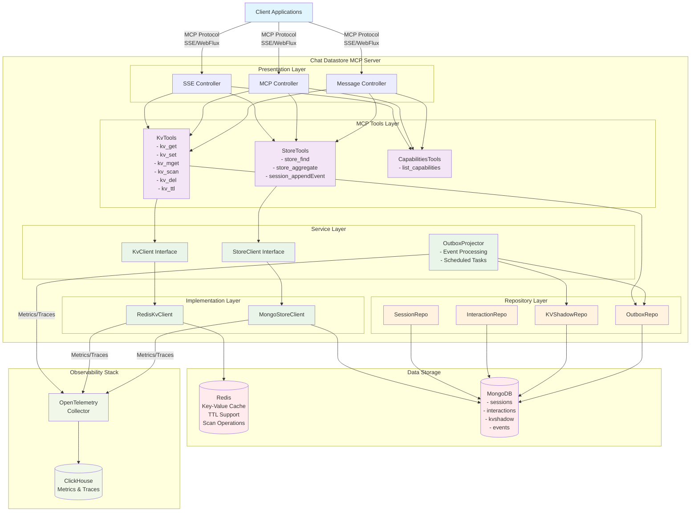
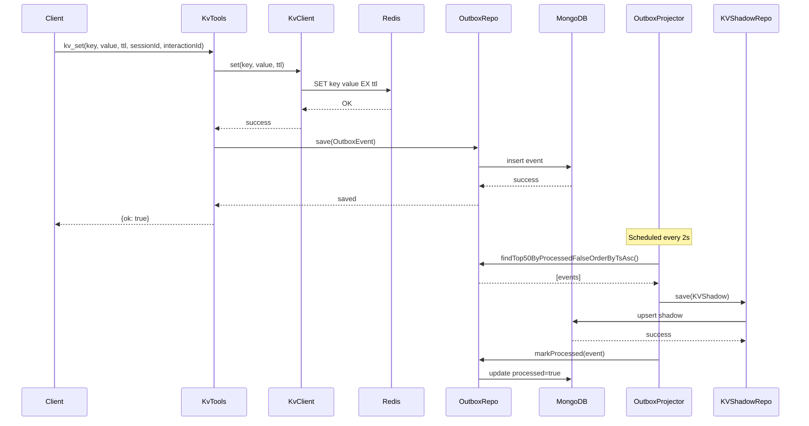
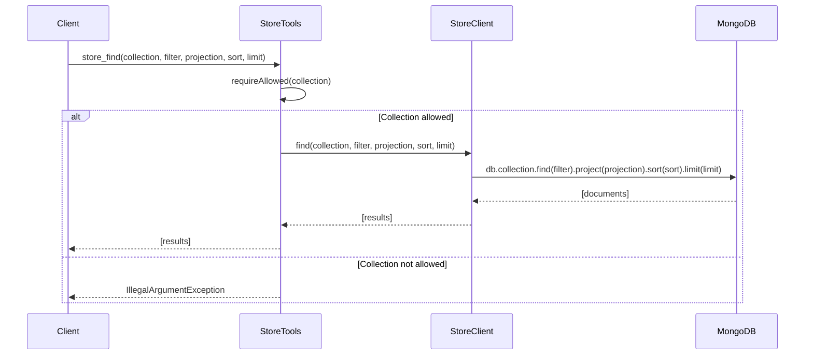
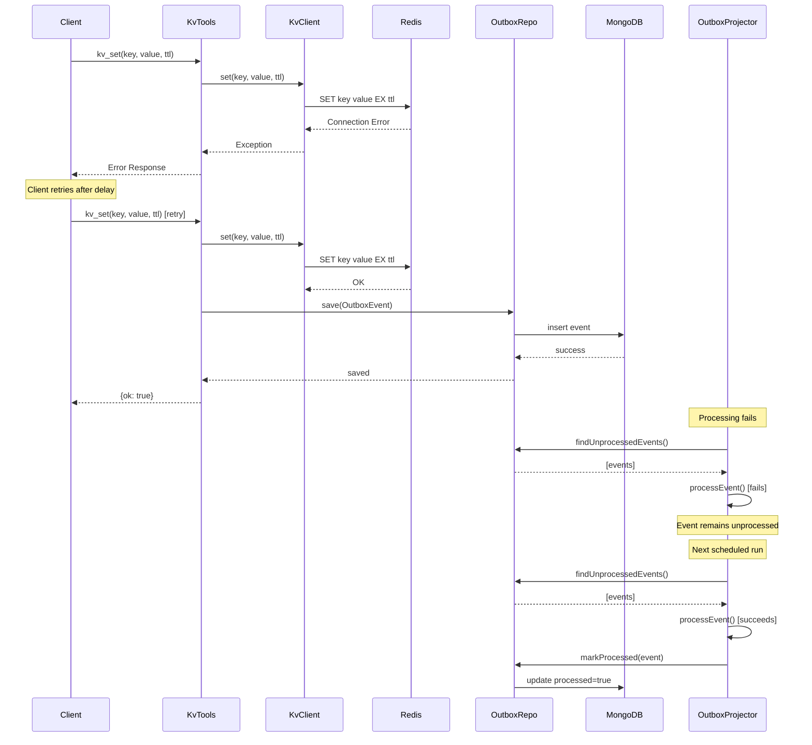
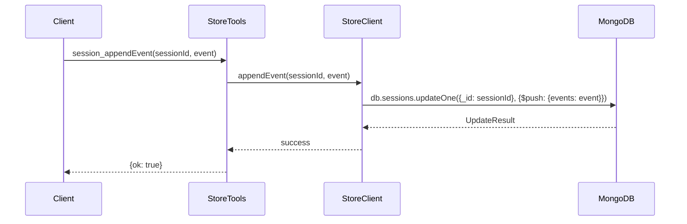

# Chat Datastore MCP Server

## Application Overview

The Chat Datastore MCP Server is a Spring Boot application that implements the Model Context Protocol (MCP) to provide chat session management and key-value storage capabilities. It serves as a backend service for chat applications, offering persistent storage for sessions, interactions, and cached data with real-time event processing.

### Key Features
- **MCP Server Implementation**: Provides tools for chat session management and key-value operations
- **Multi-Storage Architecture**: Uses MongoDB for persistent storage and Redis for caching
- **Event-Driven Architecture**: Implements outbox pattern for reliable event processing
- **Observability**: Integrated with OpenTelemetry for monitoring and tracing
- **RESTful API**: WebFlux-based reactive endpoints with Server-Sent Events (SSE) support

## System Architecture



**Architecture Overview:**
- **Presentation Layer**: Handles HTTP/SSE requests and MCP protocol communication
- **MCP Tools Layer**: Implements MCP tools for KV operations, store queries, and capabilities
- **Service Layer**: Business logic and interfaces for data access
- **Implementation Layer**: Concrete implementations for Redis and MongoDB clients
- **Repository Layer**: Data access objects for different entity types
- **Data Storage**: Redis for caching, MongoDB for persistent storage
- **Observability**: OpenTelemetry integration with ClickHouse for metrics and tracing

## Design Patterns

### 1. **Repository Pattern**
- **Implementation**: `SessionRepo`, `InteractionRepo`, `KVShadowRepo`, `OutboxRepo`
- **Purpose**: Abstracts data access logic and provides a clean interface for data operations
- **Benefits**: Separation of concerns, testability, and maintainability

### 2. **Outbox Pattern**
- **Implementation**: `OutboxProjector` service with scheduled processing
- **Purpose**: Ensures reliable event processing and eventual consistency
- **Benefits**: Guarantees event delivery, handles failures gracefully

### 3. **Tool Pattern (MCP)**
- **Implementation**: `@Tool` annotations in service classes
- **Purpose**: Exposes business logic as callable tools through MCP protocol
- **Benefits**: Standardized interface, discoverability, type safety

### 4. **Builder Pattern**
- **Implementation**: Lombok `@Builder` on model classes
- **Purpose**: Provides fluent API for object construction
- **Benefits**: Immutability, readability, optional parameters

### 5. **Dependency Injection**
- **Implementation**: Spring's IoC container
- **Purpose**: Manages object lifecycle and dependencies
- **Benefits**: Loose coupling, testability, configuration flexibility

### 6. **Event Sourcing (Partial)**
- **Implementation**: Session event streams and outbox events
- **Purpose**: Maintains audit trail and enables event replay
- **Benefits**: Traceability, debugging, analytics

## Sequence Diagrams

### 1. KV Set Operation (Success Scenario)



### 2. Store Find Operation (Success Scenario)



### 3. KV Operation Failure and Retry Scenario



### 4. Session Event Append (Success Scenario)



## Local Environment Setup

### Prerequisites
- Java 17 or higher
- Maven 3.6+
- Docker and Docker Compose
- Git

### Step 1: Clone the Repository
```bash
git clone <repository-url>
cd chat-datastore-mcp
```

### Step 2: Start Infrastructure Services
```bash
cd deploy
docker-compose up -d redis mongo clickhouse otel-collector
```

### Step 3: Verify Infrastructure
```bash
# Check Redis
docker exec -it redis redis-cli ping
# Should return: PONG

# Check MongoDB
docker exec -it mongo mongosh --eval "db.adminCommand('ping')"
# Should return: { ok: 1 }

# Check ClickHouse
curl http://localhost:8123/ping
# Should return: Ok.
```

### Step 4: Build and Run the Application

#### Option A: Run with Maven (Development)
```bash
# From project root
mvn clean compile
mvn spring-boot:run -Dspring-boot.run.profiles=local
```

#### Option B: Run with Docker
```bash
# Build and run everything
cd deploy
docker-compose up --build
```

### Step 5: Verify Application
```bash
# Check application health
curl http://localhost:8080/actuator/health

# Check MCP SSE endpoint
curl http://localhost:8080/sse
```

## Testing the Application

### Manual Testing with curl

#### 1. Test KV Operations
```bash
# Set a key-value pair
curl -X POST http://localhost:8080/mcp/message \
  -H "Content-Type: application/json" \
  -d '{
    "method": "tools/call",
    "params": {
      "name": "kv_set",
      "arguments": {
        "key": "test-key",
        "value": "test-value",
        "ttlSec": 3600,
        "sessionId": "session-123"
      }
    }
  }'

# Get a key
curl -X POST http://localhost:8080/mcp/message \
  -H "Content-Type: application/json" \
  -d '{
    "method": "tools/call",
    "params": {
      "name": "kv_get",
      "arguments": {
        "key": "test-key"
      }
    }
  }'
```

#### 2. Test Store Operations
```bash
# Find sessions
curl -X POST http://localhost:8080/mcp/message \
  -H "Content-Type: application/json" \
  -d '{
    "method": "tools/call",
    "params": {
      "name": "store_find",
      "arguments": {
        "collection": "sessions",
        "filter": {},
        "limit": 10
      }
    }
  }'
```

### Integration Testing
```bash
# Run all tests
mvn test

# Run specific test class
mvn test -Dtest=KvToolsTest

# Run with specific profile
mvn test -Dspring.profiles.active=test
```

## Postman Collection

### Import Collection
Create a new Postman collection with the following requests:

#### Collection: Chat Datastore MCP API

**Base URL**: `http://localhost:8080`

#### 1. Health Check
- **Method**: GET
- **URL**: `{{baseUrl}}/actuator/health`
- **Description**: Check application health status

#### 2. MCP Capabilities
- **Method**: POST
- **URL**: `{{baseUrl}}/mcp/message`
- **Headers**: `Content-Type: application/json`
- **Body**:
```json
{
  "method": "initialize",
  "params": {
    "protocolVersion": "2024-11-05",
    "capabilities": {},
    "clientInfo": {
      "name": "postman-client",
      "version": "1.0.0"
    }
  }
}
```

#### 3. List Tools
- **Method**: POST
- **URL**: `{{baseUrl}}/mcp/message`
- **Headers**: `Content-Type: application/json`
- **Body**:
```json
{
  "method": "tools/list",
  "params": {}
}
```

#### 4. KV Set
- **Method**: POST
- **URL**: `{{baseUrl}}/mcp/message`
- **Headers**: `Content-Type: application/json`
- **Body**:
```json
{
  "method": "tools/call",
  "params": {
    "name": "kv_set",
    "arguments": {
      "key": "user:{{$randomUUID}}",
      "value": "{{$randomFirstName}}",
      "ttlSec": 3600,
      "sessionId": "session-{{$randomUUID}}",
      "interactionId": "interaction-{{$randomUUID}}"
    }
  }
}
```

#### 5. KV Get
- **Method**: POST
- **URL**: `{{baseUrl}}/mcp/message`
- **Headers**: `Content-Type: application/json`
- **Body**:
```json
{
  "method": "tools/call",
  "params": {
    "name": "kv_get",
    "arguments": {
      "key": "user:test-key"
    }
  }
}
```

#### 6. KV Multiple Get
- **Method**: POST
- **URL**: `{{baseUrl}}/mcp/message`
- **Headers**: `Content-Type: application/json`
- **Body**:
```json
{
  "method": "tools/call",
  "params": {
    "name": "kv_mget",
    "arguments": {
      "keys": ["key1", "key2", "key3"]
    }
  }
}
```

#### 7. KV Scan
- **Method**: POST
- **URL**: `{{baseUrl}}/mcp/message`
- **Headers**: `Content-Type: application/json`
- **Body**:
```json
{
  "method": "tools/call",
  "params": {
    "name": "kv_scan",
    "arguments": {
      "prefix": "user:",
      "limit": 50
    }
  }
}
```

#### 8. Store Find Sessions
- **Method**: POST
- **URL**: `{{baseUrl}}/mcp/message`
- **Headers**: `Content-Type: application/json`
- **Body**:
```json
{
  "method": "tools/call",
  "params": {
    "name": "store_find",
    "arguments": {
      "collection": "sessions",
      "filter": {},
      "projection": {"sessionId": 1, "userId": 1, "startedAt": 1},
      "sort": {"startedAt": -1},
      "limit": 10
    }
  }
}
```

#### 9. Store Aggregate
- **Method**: POST
- **URL**: `{{baseUrl}}/mcp/message`
- **Headers**: `Content-Type: application/json`
- **Body**:
```json
{
  "method": "tools/call",
  "params": {
    "name": "store_aggregate",
    "arguments": {
      "collection": "sessions",
      "pipeline": [
        {"$group": {"_id": "$userId", "sessionCount": {"$sum": 1}}},
        {"$sort": {"sessionCount": -1}},
        {"$limit": 10}
      ]
    }
  }
}
```

#### 10. Session Append Event
- **Method**: POST
- **URL**: `{{baseUrl}}/mcp/message`
- **Headers**: `Content-Type: application/json`
- **Body**:
```json
{
  "method": "tools/call",
  "params": {
    "name": "session_appendEvent",
    "arguments": {
      "sessionId": "session-123",
      "event": {
        "type": "message",
        "timestamp": "{{$isoTimestamp}}",
        "data": {
          "content": "Hello, world!",
          "sender": "user"
        }
      }
    }
  }
}
```

### Environment Variables
Create a Postman environment with:
- `baseUrl`: `http://localhost:8080`

### Usage Instructions

1. **Import Collection**: Copy the above requests into a new Postman collection
2. **Set Environment**: Create and select the environment with `baseUrl`
3. **Initialize MCP**: Run the "MCP Capabilities" request first
4. **List Available Tools**: Run "List Tools" to see all available MCP tools
5. **Test KV Operations**: Use KV Set/Get/Scan requests to test caching
6. **Test Store Operations**: Use Store Find/Aggregate to test MongoDB queries
7. **Monitor Events**: Check the outbox events processing by querying the events collection

### Testing Workflow

1. **Health Check** → Verify application is running
2. **Initialize MCP** → Establish MCP protocol connection
3. **List Tools** → Confirm all tools are available
4. **KV Operations** → Test Redis caching functionality
5. **Store Operations** → Test MongoDB query capabilities
6. **Event Processing** → Verify outbox pattern is working

The application provides comprehensive chat session management with reliable event processing, making it suitable for production chat applications requiring persistent storage and caching capabilities.
